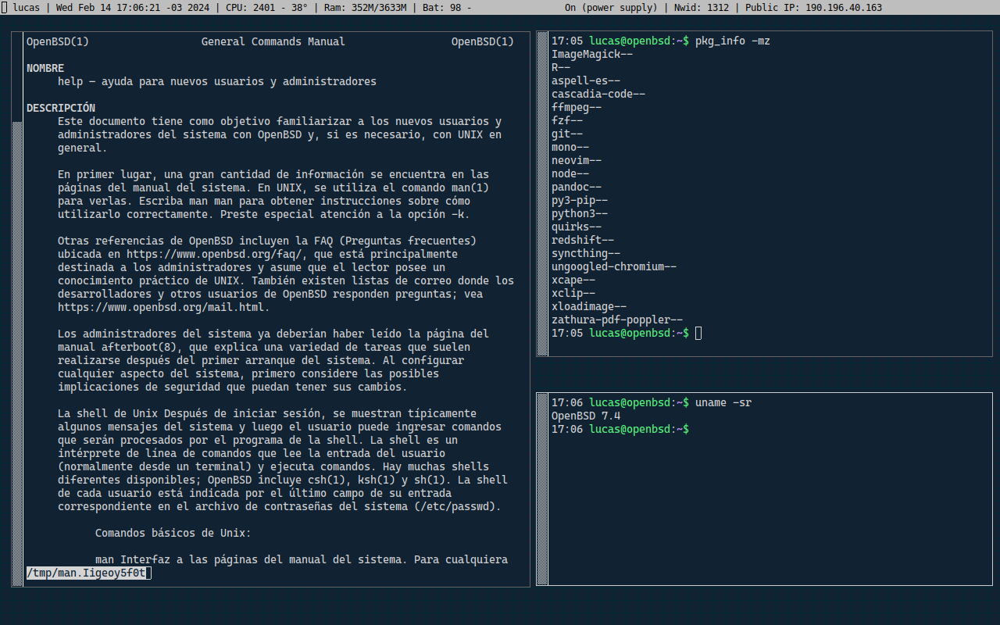

----------------------------------------------------------------------

Screenshot:



Configuración mínima con cwm.

Se trata de una configuración que busca alterar en lo mínimo la experiencia nativa del sistema, dando preeminencia a las herramientas que se
encuentran en el repositorio oficial de OpenBSD.

# Instalación

Para la instalación mayoritariamente se debe seguir las indicaciones que
aparecen en la página
[c0fee](https://www.c0ffee.net/blog/openbsd-on-a-laptop):

# Conexión Wifi

Para la conexión de internet por wifi debemos tener presente siempre el
comando *ifconfig*.

Los comandos importantes son:

``` bash
ifconfig iwn0 up
ifconfig iwn0 scan
```

Luego, para conectarse con una red en específico:

``` bash
ifconfig iwn0 nwid YOUR_SSID wpakey "YOUR_PASSPHRASE"
dhclient iwn0
```
# Configuración

Retirar la ventana de xconsole de la pantalla de login:

``` bash
sed -i 's/xconsole/#xconsole/' /etc/X11/xenodm/Xsetup_0
echo 'xset b off' >> /etc/X11/xenodm/Xsetup_0
```

Respecto a la grabación de audio en mi Thinkpad T420 lo modifico para:

``` bash
record.adc-0:1_source=mic3
```

Lo anterior varía completamente respecto del equipo, sin embargo una
manera de saber cuál es la opción correcta podemos intentar con:

``` bash
# mixerctl record.adc-0:1_source=toggle
```

Lo que modificará la entrada de dispositivo de audio para la captura de
audio, con esto, se puede ir [probando con
aucat](https://www.openbsd.org/faq/faq13.html).
